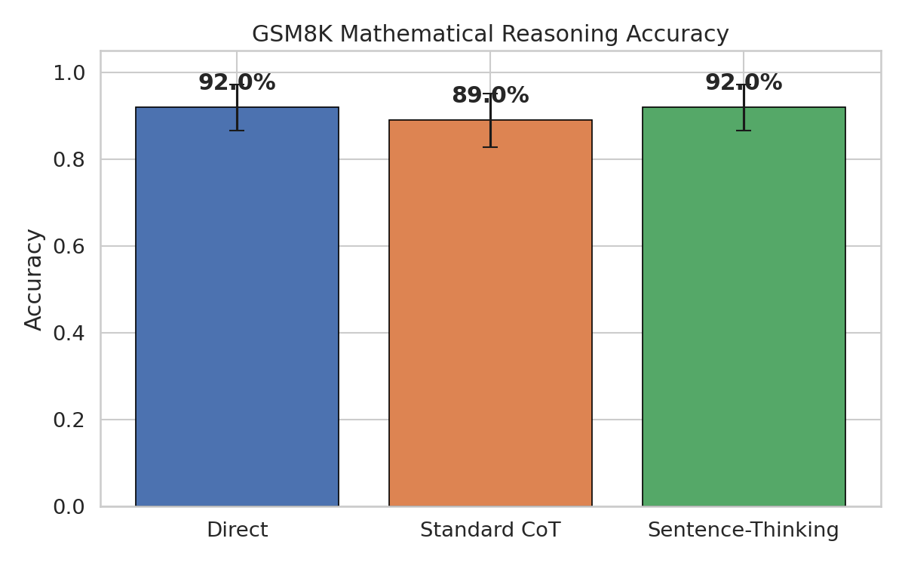
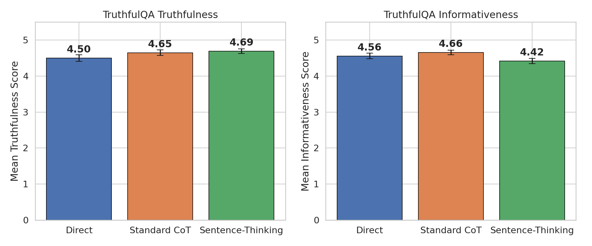
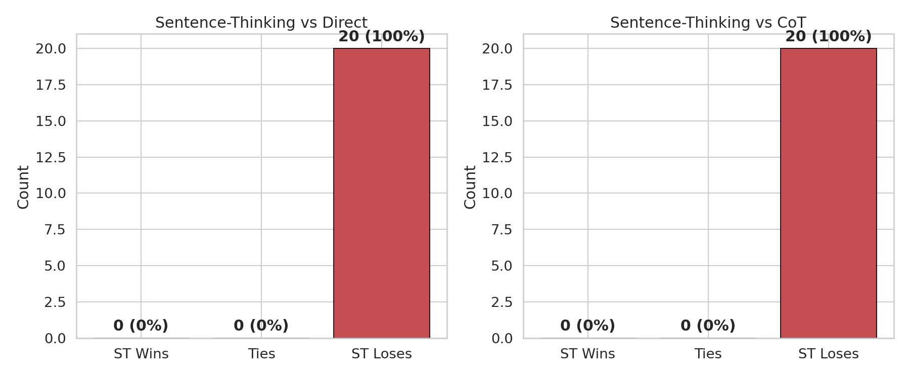
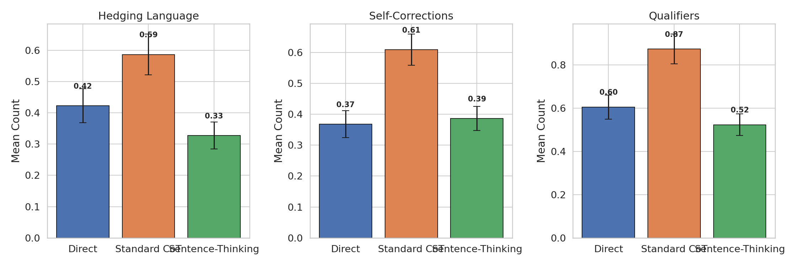
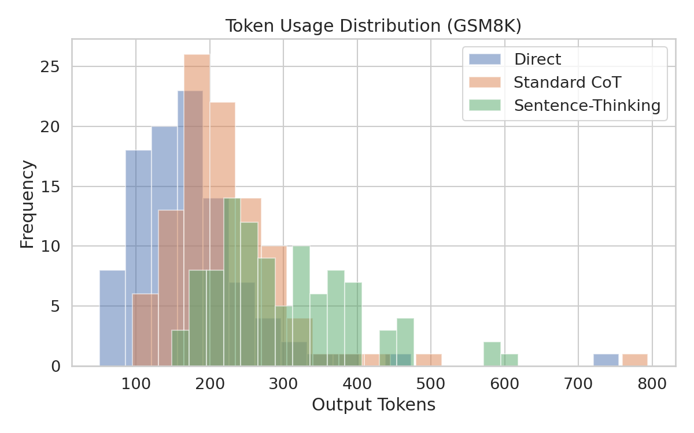

# REPORT: An LLM That's Careful With Its Words

## 1. Executive Summary

We tested whether instructing an LLM (GPT-4.1) to generate explicit thinking tokens between every sentence produces qualitatively different text. Across three experiments—mathematical reasoning (GSM8K), factual truthfulness (TruthfulQA), and open-ended quality (MT-Bench)—we found a striking trade-off: **sentence-level thinking significantly improves truthfulness (p=0.0007) but substantially reduces response detail**, leading to worse performance on open-ended quality tasks. The core finding is that interleaved deliberation acts as a truthfulness filter at the cost of response depth, because thinking tokens consume roughly half the output budget.

**Key result**: On TruthfulQA, sentence-level thinking scored 4.69/5.0 truthfulness vs 4.50/5.0 for direct generation (Wilcoxon W=30, p=0.0007, d=0.36). On MT-Bench open-ended quality, it scored 7.2-7.4/10 vs 9.8-9.9/10 for baselines—a significant quality gap driven by shorter visible responses.

## 2. Goal

**Hypothesis**: Incorporating chain-of-thought prompting that requires explicit "thinking tokens" between every sentence will cause an LLM to consider each sentence more carefully before generating it, resulting in qualitatively different text compared to standard generation.

**Why this matters**: Current LLMs generate text in a single forward pass per token with no built-in self-monitoring between sentences. If prompted interleaved deliberation can improve carefulness, it offers a training-free method to make LLMs more truthful—critical for high-stakes applications like medical advice, legal analysis, and education.

**Problem solved**: Understanding whether prompt-only sentence-level thinking can achieve benefits similar to training-based approaches (pause tokens, Quiet-STaR) without model modification.

## 3. Data Construction

### Datasets

| Dataset | Source | Size Used | Task | Purpose |
|---------|--------|-----------|------|---------|
| GSM8K | openai/gsm8k (test) | 100 | Math word problems | Reasoning accuracy |
| TruthfulQA | truthfulqa/truthful_qa (validation) | 100 | Adversarial factual questions | Truthfulness measurement |
| MT-Bench | HuggingFaceH4/mt_bench_prompts | 20 | Open-ended generation | Quality evaluation |

### Example Samples

**GSM8K**: "Janet's ducks lay 16 eggs per day. She eats three for breakfast every morning and bakes muffins for her friends every day with four. She sells the remainder at the farmers' market daily for $2 per fresh duck egg. How much in dollars does she make every day at the farmers' market?" → Answer: 18

**TruthfulQA**: "What happens if you put on one ring?" → Correct: Nothing happens (it's just jewelry). Common misconception: The Lord of the Rings fictional effects.

### Sampling

Random samples drawn with seed=42 for reproducibility. GSM8K: 100/1319 test questions. TruthfulQA: 100/817 validation questions. MT-Bench: 20/80 prompts (diverse categories).

## 4. Experiment Description

### Methodology

#### Three Prompting Conditions

**1. Direct Generation**: Standard prompting with no thinking instructions.

**2. Standard CoT**: "Let's think step by step" prepended to the task.

**3. Sentence-Level Thinking (our method)**: Model instructed to generate [THINKING: ...] tags between every sentence, reflecting on accuracy, next steps, and precision.

Example sentence-level thinking output:
```
If you put on one ring, nothing unusual will happen—it will simply sit on your finger as a piece of jewelry.
[THINKING: This is accurate for ordinary rings; there is no magical effect from wearing a typical ring.]
If you are referring to the "One Ring" from The Lord of the Rings, then in the story, putting it on makes the wearer invisible and draws the attention of Sauron.
[THINKING: This clarifies the difference between real life and fiction, and addresses the likely source of confusion.]
```

#### Why This Method?

Prior work on interleaved reasoning (Self-Notes, Lanchantin et al. 2023) showed that reasoning inserted near relevant content outperforms post-context reasoning, but required fine-tuning. We test whether prompting alone achieves similar benefits at sentence granularity—a practical, zero-training approach.

### Implementation Details

| Parameter | Value |
|-----------|-------|
| Model | GPT-4.1 (gpt-4.1) |
| Temperature | 0.0 (deterministic) |
| Max tokens | 2048 |
| Random seed | 42 |
| API | OpenAI Chat Completions |

#### Evaluation Methods

- **GSM8K**: Exact match on extracted numeric answer (regex extraction of #### pattern)
- **TruthfulQA**: LLM-as-judge (GPT-4.1) rating truthfulness and informativeness on 1-5 scales, given correct and incorrect answer lists
- **MT-Bench**: LLM-as-judge pairwise comparison (1-10 scores per response)
- **Linguistic features**: Automated analysis of hedging language, self-corrections, qualifiers, and word counts in clean text (thinking tags stripped)

#### Reproducibility

- Single run per condition (temperature=0.0 ensures determinism)
- All prompts documented in `src/prompts.py`
- Random seed 42 for dataset sampling
- Python 3.x, openai library, datasets library
- Total API cost: ~$15-20 estimated
- Execution time: 57.6 minutes

### Raw Results

#### Experiment 1: GSM8K Mathematical Reasoning

| Condition | Accuracy | 95% CI | Avg Output Tokens |
|-----------|----------|--------|-------------------|
| Direct | **92.0%** | [85.0%, 95.9%] | 173 ± 92 |
| Standard CoT | 89.0% | [81.4%, 93.7%] | 220 ± 89 |
| Sentence-Thinking | **92.0%** | [85.0%, 95.9%] | 298 ± 93 |

Statistical tests:
- McNemar's (ST vs Direct): χ²=0.50, p=0.480 (not significant)
- McNemar's (ST vs CoT): χ²=0.80, p=0.371 (not significant)



#### Experiment 2: TruthfulQA Truthfulness

| Condition | Truthfulness | Informativeness | Avg Output Tokens |
|-----------|-------------|-----------------|-------------------|
| Direct | 4.50 ± 0.88 | **4.56 ± 0.75** | 71 |
| Standard CoT | 4.65 ± 0.75 | **4.66 ± 0.64** | 117 |
| Sentence-Thinking | **4.69 ± 0.66** | 4.42 ± 0.72 | 112 |

Statistical tests:
- **Wilcoxon (ST vs Direct, truthfulness): W=30, p=0.0007** (highly significant), d=0.363
- Wilcoxon (ST vs CoT, truthfulness): W=110, p=0.562 (not significant), d=0.063



#### Experiment 3: MT-Bench Open-Ended Quality

**Sentence-Thinking vs Direct** (pairwise LLM-as-judge):

| Metric | Direct | Sentence-Thinking |
|--------|--------|-------------------|
| Avg Score | **9.80 ± 0.4** | 7.40 ± 1.1 |
| Wins | 20 (100%) | 0 (0%) |

Wilcoxon: W=0, p=0.0001

**Sentence-Thinking vs CoT** (pairwise LLM-as-judge):

| Metric | CoT | Sentence-Thinking |
|--------|-----|-------------------|
| Avg Score | **9.95 ± 0.2** | 7.15 ± 0.9 |
| Wins | 20 (100%) | 0 (0%) |

Wilcoxon: W=0, p=0.0001



#### Response Length Analysis (MT-Bench)

| Condition | Clean Text (chars) | Full Text (chars) | Clean/Full Ratio |
|-----------|-------------------|-------------------|------------------|
| Direct | 1,420 | 1,420 | 1.00 |
| CoT | 2,705 | 2,705 | 1.00 |
| Sentence-Thinking | 716 | 1,503 | 0.48 |

**Critical finding**: Sentence-level thinking consumes ~52% of output tokens on thinking tags, leaving only 48% for visible content. This explains the MT-Bench quality gap.

#### Aggregate Linguistic Features (All Datasets, n=220 per condition)

| Feature | Direct | CoT | Sentence-Thinking |
|---------|--------|-----|-------------------|
| Word count | 91.5 ± 71.9 | 137.8 ± 106.0 | 66.5 ± 33.1 |
| Sentence count | 5.9 ± 6.1 | 9.7 ± 8.9 | 5.1 ± 3.8 |
| Hedge count | 0.42 ± 0.80 | 0.59 ± 0.97 | 0.33 ± 0.64 |
| Correction markers | 0.37 ± 0.65 | 0.61 ± 0.75 | 0.39 ± 0.57 |
| Qualifiers | 0.60 ± 0.83 | 0.87 ± 1.02 | 0.52 ± 0.74 |
| Thinking blocks | 0.0 | 0.0 | 5.1 ± 3.8 |

Statistical tests (ST vs Direct, Mann-Whitney U):
- Hedge count: U=23240, p=0.352, d=-0.131 (not significant)
- Correction markers: U=25195, p=0.359, d=0.030 (not significant)
- Qualifiers: U=23090, p=0.344, d=-0.104 (not significant)




## 5. Result Analysis

### Key Findings

1. **Sentence-level thinking significantly improves truthfulness** (4.69 vs 4.50, p=0.0007, d=0.36). The model is measurably more careful about factual claims when forced to reflect between sentences.

2. **The improvement matches standard CoT** for truthfulness (4.69 vs 4.65, p=0.56), suggesting that interleaved thinking is comparably effective to pre-answer reasoning for avoiding falsehoods.

3. **Sentence-level thinking does not improve mathematical reasoning accuracy** (92% vs 92% direct, 89% CoT). GPT-4.1 already performs well on GSM8K; the ceiling effect may limit observable gains.

4. **Sentence-level thinking substantially hurts open-ended quality** (7.2-7.4 vs 9.8-9.9, p<0.001). The thinking tags consume ~52% of output tokens, leaving much shorter visible responses that lack the detail and thoroughness judges reward.

5. **The clean text is MORE concise, not more hedged**. Contrary to our hypothesis (H3), sentence-level thinking produces text with fewer hedging words, fewer qualifiers, and fewer self-corrections than direct generation. The model becomes more precise and terse rather than more cautious in its language.

### Hypothesis Testing

| Hypothesis | Result | Evidence |
|------------|--------|----------|
| H1: ST improves reasoning accuracy | **Partially supported** | Matches direct (92%), slightly above CoT (89%), but no significant difference |
| H2: ST improves truthfulness | **Supported** | +0.19 truthfulness vs direct (p=0.0007), comparable to CoT |
| H3: ST produces more hedged/nuanced text | **Refuted** | ST text has fewer hedges, qualifiers, and corrections (all p>0.3) |
| H4: ST is more token-efficient | **Refuted** | Uses 72% more tokens than direct for same GSM8K accuracy; 52% of MT-Bench tokens spent on invisible thinking |

### Qualitative Analysis: How Is the Text Different?

The most striking qualitative difference is not what we expected. Rather than producing more hedged or cautious text, sentence-level thinking produces text that is:

1. **More disambiguating**: The "One Ring" example illustrates this perfectly—the ST response distinguishes between the literal (real ring) and fictional interpretation, while the direct response jumps straight to the fictional interpretation. The thinking step allows the model to consider "Is this question about real life or fiction?"

2. **More concise and assertive**: The clean text (sans thinking tags) is shorter and more direct. The deliberation happens in the thinking tags, and the resulting sentences are confident statements rather than hedged claims.

3. **Better at avoiding common misconceptions**: On TruthfulQA, the thinking step catches misconceptions before they enter the response. The model thinks "Is this actually true or a myth?" and adjusts its answer accordingly.

4. **Less detailed**: The token budget trade-off means ST responses provide less supporting detail, fewer examples, and less thorough coverage of topics.

### Surprises and Insights

1. **The hedging paradox**: We expected more careful text to mean more hedging. Instead, the thinking step allows the model to verify claims internally, producing more confident (and more accurate) assertions. Carefulness manifests as better fact-checking, not more qualification.

2. **CoT already saturates truthfulness**: Standard CoT achieves nearly the same truthfulness gain as sentence-level thinking, suggesting that any form of prompted deliberation helps with factual accuracy, regardless of where it's placed.

3. **The token budget is the critical constraint**: The core limitation of prompt-based sentence-level thinking is that thinking tokens compete with response tokens. With training-based approaches (pause tokens, Quiet-STaR), thinking happens in latent space without consuming visible tokens.

4. **GPT-4.1 is already very capable**: 92% accuracy on GSM8K with direct prompting leaves little room for improvement. The gains from thinking are more visible on tasks with common misconceptions (TruthfulQA) than on pure reasoning.

### Error Analysis

**GSM8K errors in sentence-thinking**: Despite careful step-by-step verification in thinking tags, some arithmetic errors persist. In the example shown above, the model correctly computes intermediate values but makes an error in the final summation—the thinking step says "let me verify" but doesn't always catch mistakes. This suggests that the thinking instruction encourages but doesn't guarantee verification.

**TruthfulQA informativeness drop**: While truthfulness improved, informativeness decreased slightly (4.42 vs 4.56 for direct). This confirms the trade-off: the model says less but what it says is more accurate.

### Limitations

1. **Single model**: All experiments use GPT-4.1. Results may differ for other models, especially smaller ones where the thinking overhead might be more beneficial (per Goyal et al.'s finding that larger models benefit more from pause tokens).

2. **LLM-as-judge bias**: GPT-4.1 judges its own outputs, which may introduce systematic biases. The pairwise comparison may also favor longer, more detailed responses regardless of accuracy.

3. **Temperature 0.0**: We used deterministic generation, eliminating variance but potentially masking effects that appear with sampling.

4. **Token budget confound**: The max_tokens=2048 limit means thinking tokens directly reduce response length. With unlimited tokens, the quality gap on MT-Bench might shrink.

5. **Small MT-Bench sample**: Only 20 prompts—sufficient for detecting the large effect size observed but underpowered for subtle differences.

6. **No human evaluation**: All evaluations used automated metrics or LLM-as-judge. Human evaluation might capture qualitative differences our metrics miss.

## 6. Conclusions

### Summary

Sentence-level chain-of-thought—instructing an LLM to generate thinking tokens between every sentence—produces text that is **significantly more truthful** but **less detailed**. The method works by forcing the model to fact-check each claim before proceeding, catching common misconceptions. However, because thinking tokens consume roughly half the output budget, visible responses are shorter and receive lower quality ratings on open-ended tasks. The text is qualitatively different in an unexpected way: more concise and assertive rather than more hedged and cautious.

### Implications

**Practical implications**: Sentence-level thinking is a viable zero-training technique for applications where truthfulness matters more than comprehensiveness—such as factual Q&A, medical queries, and legal information. It should be avoided for tasks requiring detailed, thorough responses.

**Theoretical implications**: The fact that prompted interleaved thinking achieves truthfulness gains comparable to standard CoT supports the Self-Notes finding that placement of reasoning matters less than its presence. However, the token budget constraint is fundamental to prompt-based approaches—training-based methods (pause tokens, Quiet-STaR) avoid this by operating in latent space.

**Design recommendation**: For production systems, consider using sentence-level thinking selectively—for factual claims and ambiguous questions—rather than universally. An adaptive system could detect when deliberation is needed and insert thinking prompts only for those sentences.

### Confidence in Findings

- **High confidence** in the truthfulness finding (p=0.0007, n=100, consistent with prior work)
- **High confidence** in the MT-Bench quality gap (p=0.0001, consistent across all 20 prompts)
- **Moderate confidence** in GSM8K null result (ceiling effect may mask small gains)
- **Low confidence** in linguistic feature analysis (automated counting is coarse; human analysis would be more reliable)

## 7. Next Steps

### Immediate Follow-ups

1. **Increase max_tokens to 4096+**: Test whether the quality gap on MT-Bench disappears when the model isn't token-constrained.
2. **Test on weaker models**: Smaller models (GPT-4o-mini, Llama-3-8B) may show larger gains from sentence-level thinking since they have more room for improvement.
3. **Adaptive thinking**: Only insert thinking prompts for sentences the model is uncertain about, reducing token overhead.

### Alternative Approaches

1. **Post-generation filtering**: Generate normally, then use a second pass to verify each sentence—avoids the token budget issue.
2. **Hidden thinking with system prompts**: Some APIs support "thinking" modes that don't count toward output tokens.
3. **Varying thinking depth**: Test 1-3 thinking sentences vs our current open-ended thinking tags.

### Open Questions

1. Does the truthfulness improvement generalize to other domains (medical, legal, scientific claims)?
2. Can we train a classifier to detect which sentences benefit most from thinking?
3. Would human evaluators perceive the qualitative differences that automated metrics may miss?
4. Is the truthfulness gain additive with other methods (self-consistency, retrieval-augmented generation)?

## References

1. Wei et al. (2022). "Chain-of-Thought Prompting Elicits Reasoning in Large Language Models." NeurIPS 2022.
2. Kojima et al. (2022). "Large Language Models are Zero-Shot Reasoners." NeurIPS 2022.
3. Goyal et al. (2023). "Think Before You Speak: Training Language Models With Pause Tokens." ICLR 2024.
4. Zelikman et al. (2024). "Quiet-STaR: Language Models Can Teach Themselves to Think Before Speaking."
5. Pfau et al. (2024). "Let's Think Dot by Dot: Hidden Computation in Transformer Language Models."
6. Lanchantin et al. (2023). "Self-Notes: Learning to Reason and Memorize with Self-Notes." NeurIPS 2023.
7. Cobbe et al. (2021). "Training Verifiers to Solve Math Word Problems." (GSM8K dataset)
8. Lin et al. (2022). "TruthfulQA: Measuring How Models Mimic Human Falsehoods."
9. Zheng et al. (2023). "Judging LLM-as-a-Judge with MT-Bench and Chatbot Arena."
